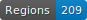
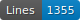

# TranscriboQuest - Modern documents

   

This repo contains the transcription of modern manuscripts

## Content

| Author     | Language | Transcriber                     | Century |
|------------|----------|---------------------------------|---------|
| Flaubert   | French   | E. Morlock and St. Dord-Crouslé | 19th c. |
| Anonymous  | Italian  | S. Crespi                       | 17th c. |
| King James | English  | B. Chaix Rouchon                | 17th c. |
| Leibniz    | French   | D. Rabouin                      | 17th c. |
| Harriot    | Latin    | A. Remaki                       | 17th c. |

## How to cite

Cf. [`htr-united.yml`](https://github.com/gabays/TranscriboQuest_Modern/blob/main/htr-united.yml) file.

## Licences
Annotation is CC-BY. Images belong to the digital libraries.

 